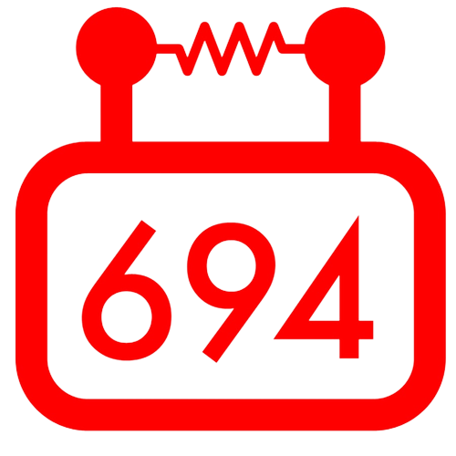

# Hi, I'm Ivan Chen.

*Tech Lead* at  [StuyPulse](https://stuypulse.com)

*Director of IT* at [StuySU Junior Caucus](https://junior.stuysu.org)

*Lead Designer* and *Software Developer* at [The Stuyvesant Spectator](https://stuyspec.com)


## A little bit more about me...

I'm a high school student who enjoys working on programming projects. I have interests in cryptography, artificial intelligence, and IT infrastructure, but all tech related topics are welcome.

```javascript
const ivan = {
    pronouns: "he" | "him",
    code: [Typescript, Javascript, Python, Java, HTML, CSS],
    tools: [React, Next, Node, Express, PostgreSQL, MongoDB, Heroku, Docker],
    status: "Junior at Stuyvesant High School",
    location: "New York, New York",
    supports: "Right to Repair",
    am: ["Programmer", "Web Developer", "Designer", "Computer / IT Geek", "Coffee Consumer"]
}
```

<p align="center">
    <a href="https://ivanchen.dev"></a>
    <a href="https://stuy.enschool.org"></a>
    <a href="https://github.com/StuyPulse"></a>
    <a href="https://github.com/StuySpec"></a>
    <a href="https://github.com/StuySU"></a>
</p>

<details align="center">
    <summary>➸ Details</summary>
    <p align="center">
        
    </p>
    </p align="center">
        
    </p>
</details>
